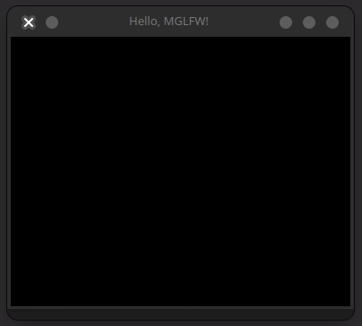

# Getting Started with MGLFW
## Installing
Using MGLFW is simple, but first you need to download it. There are 2 places you can get MGLFW.
1. From the [latest Github release](https://github.com/Skelebyte/mglfw)
2. Using the crate (work in progress)

### Getting it from Github
If you wish to choose the Github release route you need to go [here](https://github.com/Skelebyte/mglfw) to download the latest (preferably stable) release.

Once it is downloaded, you want to move the `mglfw.rs` file to your `src` folder, or somewhere else you want to keep it.

Then in your `main.rs` file you can add the line `mod mglfw;` to include it to your script.

### Getting it as a crate
Work in progress...

## Actually using it
MGLFW is separated into modules so you can pick and choose which portion of MGLFW you want, although most portions require the MGLFW struct.

If, for example, you want to just create a blank window you need to use the `core` module.

```rust
// This is where you would put the `mod mglfw` or crate reference.

use mglfw::core; // Only use the core mglfw module, used for window and glfw context creation.

fn main() {
    println!("Hello, world!");
}
```

To create the window is as simple as creating a new `mglfw` context.

```rust
fn main() {
    let mut mglfw = core::Mglfw::new("Hello, MGLFW!", 300, 300);
}
```

The issue now is that if you just ran this code now, it would just close. To fix this we add a while loop to check if MGLFW is still running.

```rust
fn main() {
    let mut mglfw = core::Mglfw::new("Hello, MGLFW!", 300, 300);

    while mglfw.is_running() {

    }
}
```

And to ensure the program will close when we tell it to, we add `mglfw.update();` inside the while loop.
```rust
while mglfw.is_running() {
    mglfw.update();
}
```

And now if you run the program, you should have a simple window up and running!


Full code:
```rust
mod mglfw;
use mglfw::core;

fn main() {
    let mut mglfw = core::Mglfw::new("Hello, MGLFW!", 300, 300);

    while mglfw.is_running() {
        mglfw.update();
    }
}
```